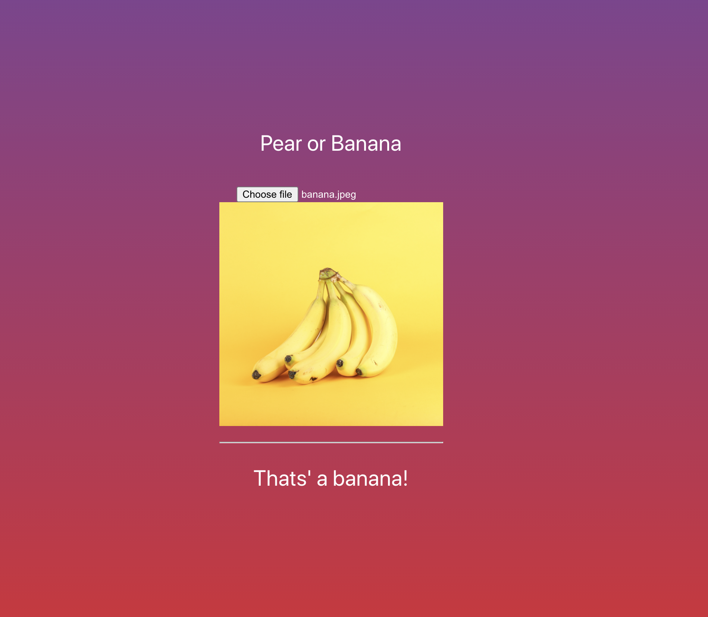
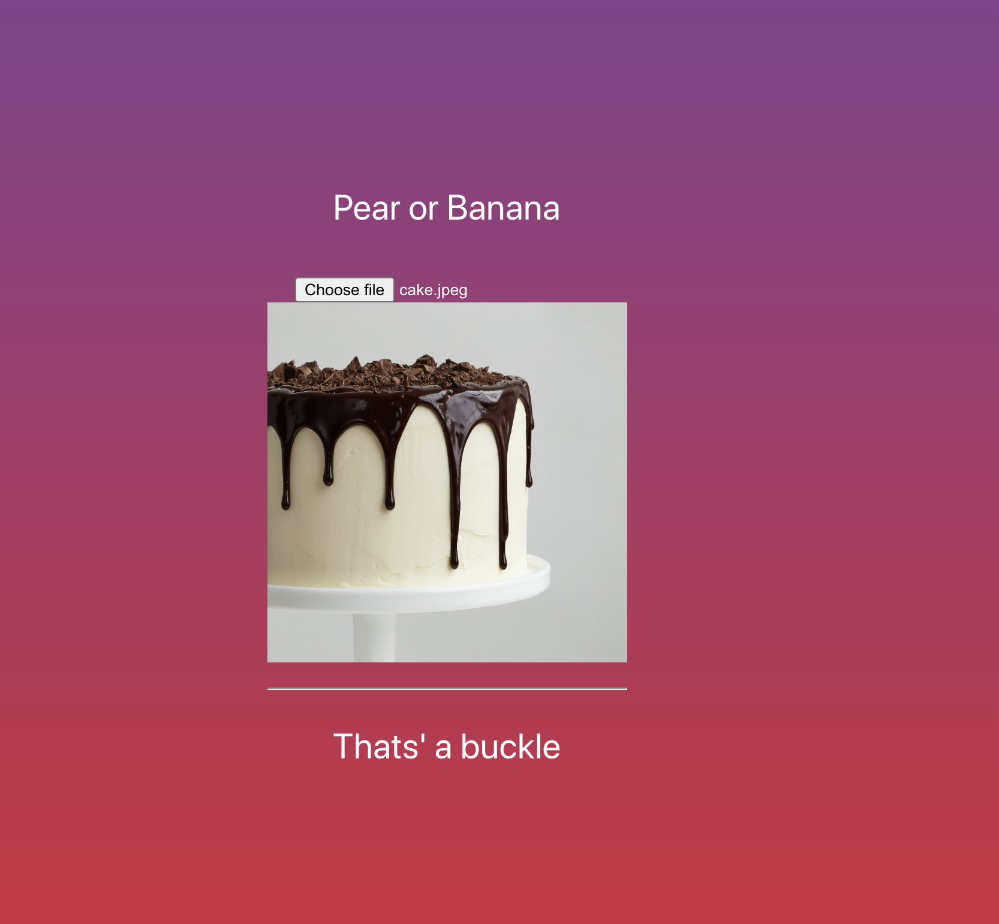
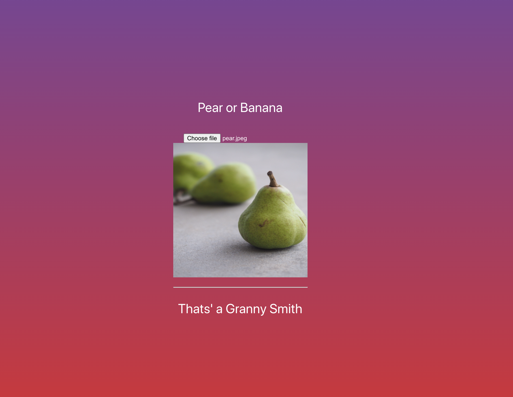

## Pytorch image classifiaction example
# Pear or Banana (and some things more)
This is an example project for a computer vision
classifier with a frontend built in react
and a backend built with fastAPI and pytorch.

## Frontend
npm install
npm start

## Backend
cd backend
uvicorn main:app --reload --port 8082

